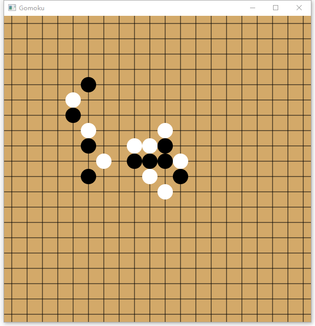

# Gomoku Game

## Features
Play with Artificial Intelligence (Deep Learning)

## Status
+ Gomoku Game Status -> Data Structure (Scenario)
+ Train Deep Learning Network with prepared data
+ Famous Gomoku game data into data -> Return Step 2
+ A virtual PC player to play "Randomly" -> To generate Gomoku games -> Return Step 2
+ Data Structure to save the trained network
+ Online game -> Grow intelligence game after game

## E-mail
longyang_123@yeah.net  
You're most welcome to contact with me to discuss any detail about this project